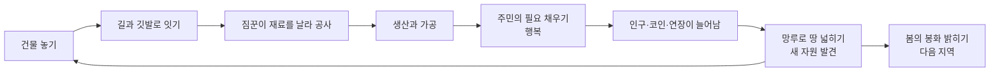
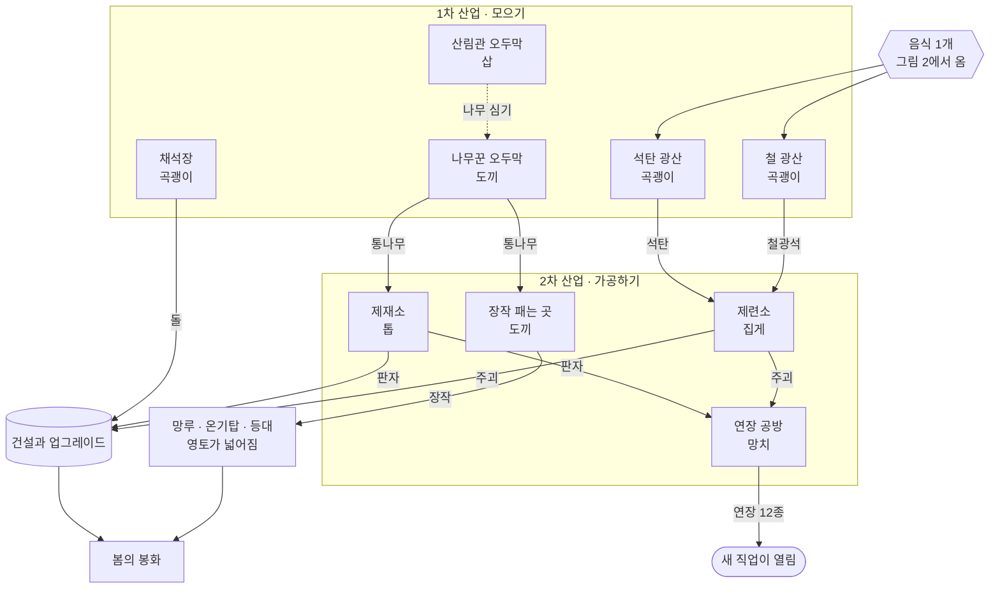
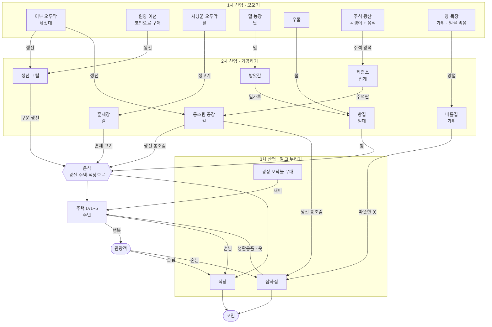

# 07. 세틀러식 새 게임 — 기획 초안 v0.1 (가제: 봄의 봉화)

> **대표님용 요약**
> - 이 문서는 새 게임의 **첫 기획 초안**이에요. 확정본이 아니에요. 대표님이 읽고 "좋아요 / 이건 바꿔요"를 말씀해 주시면 그걸로 확정해요.
> - 한 줄 소개: **끝나지 않는 겨울, 촌장이 되어 건물을 직접 놓고 길과 깃발을 이어 주면, 수백 명의 꼬마 주민이 깃발에서 깃발로 물건을 이어 날라 마을을 키우고, 지역마다 '봄의 봉화'를 밝혀 눈을 녹이는 게임.**
> - 세틀러에서 가져오는 재미: 건물을 원하는 곳에 놓기, 길·깃발·짐꾼, 긴 생산 줄(통나무→판자, 밀→밀가루→빵, 광석+석탄→주괴→연장), 연장이 있어야 생기는 직업, 음식을 먹어야 일하는 광산, 망루로 땅 넓히기, 바글바글 일하는 모습 구경하기.
> - 서리마을에서 그대로 쓰는 것: 지금 그림체와 캐릭터 11명, 주민 17명과 동물 3마리, 건물·소품 70여 종, 이모티콘, 효과, 소리 41개, 그리고 이것들을 더 만드는 도구 전부. 새로 그릴 것은 주로 **새 건물(레벨별 모습), 길과 깃발, 새 물건 그림, 봄 풍경**이에요.
> - 대표님이 해 주실 일: 맨 끝 **"17. 대표님이 정해 주실 것"** 의 질문에 답해 주세요. 답을 받으면 회색 상자로 된 시제품부터 만들어서 휴대폰으로 해 볼 수 있는 링크로 보여 드릴게요.

---

## 이 문서 읽는 법 (다음 Claude 세션용)

- 1~13절은 게임 기획(무엇을 만들지), 14~16절은 제작(무엇을 재사용하고 어떤 순서로 만들지), 17절은 대표님 결정 사항, 부록은 데이터 형식 제안이다.
- 경로 표기: `tools/...`, `src/...`, `assets/...` 는 **서리마을 게임 폴더 기준**이다. 이사 키트(`make_kit.sh`)로 옮긴 새 저장소에서는 원본이 `reference/frost-village/` 아래에 있고, 미리보기 그림은 `docs/reference/previews/`, 전작 계약서·보고서는 `docs/reference/` 에 있다. 새 게임 폴더는 `game/` 을 권장한다(`CLAUDE.md`).
- 숫자(시간·비용·반경)는 전부 **초안**이다. 서리마을처럼 봇 시뮬레이션으로 재서 맞춘다(11절).
- "지금 있는 그림" 칸의 키는 실제 매니페스트에서 확인한 것이다(`assets/*/manifest.json`). "새로 만들 것" 칸의 키 이름은 제안이며, 확정은 계약서 부록에서 한다(15.4절).
- 대표님께 설명할 때는 한국어로, 쉬운 말로 한다(`CLAUDE.md` 사용자 규칙).

## 목차
1. 한 줄 소개와 게임의 모습
2. 플랫폼 추천
3. 핵심 재미와 반복 흐름
4. 이야기와 지역(챕터) — 봄의 봉화
5. 건물 목록과 생산 줄
6. 길·깃발·짐꾼 규칙
7. 연장과 직업
8. 영토 — 온기로 넓히는 땅
9. 주민·필요·행복·관광객·도감
10. 건물 레벨 1~5
11. 경제와 진행 속도 목표
12. 조작과 화면 (터치 우선, PC 함께)
13. '바글바글' 성능 목표와 근거
14. 서리마을에서 그대로 쓰는 것과 새로 만들 것
15. 새 프로젝트에서 재사용하는 법
16. 단계별 로드맵
17. 대표님이 정해 주실 것
- 부록 A. 데이터 형식 제안 (다음 Claude용)
- 부록 B. 새 에셋 키 이름 제안

---

## 1. 한 줄 소개와 게임의 모습

**가제:** 봄의 봉화 (다른 후보는 17절 질문 10번)

**장르:** 마을 건설과 물류 경영. 세틀러(블루바이트의 The Settlers, 특히 2편) 계열에 서리마을의 아기자기한 주민 생활을 더한다.

**한 줄 소개:** 끝나지 않는 겨울, 촌장이 되어 건물을 직접 놓고 길과 깃발을 이어 주면, 수백 명의 꼬마 주민이 깃발에서 깃발로 물건을 이어 날라 마을을 키우고, 지역마다 '봄의 봉화'를 밝혀 눈을 녹이는 게임.

**화면의 모습:**
- 확대하면, 노란 파카 짐꾼이 통나무를 깃발 옆에 내려놓고, 다음 구간 짐꾼이 그걸 받아 제재소로 간다. 제재소 톱이 돌고(지금 있는 `station_sawmill` 작업 동작), 판자가 공사장으로 간다. 광장에서는 음유시인이 연주하고 아이들이 눈싸움을 한다.
- 축소하면, 눈 덮인 골짜기에 길이 거미줄처럼 퍼져 있고, 굴뚝마다 연기가 오르고, 점 같은 주민 수백 명이 바쁘게 오간다.
- 봉화를 밝히면, 불기둥이 솟고 눈이 녹는 물결이 퍼지면서 땅이 초록으로 바뀌고, 주민 모두가 춤춘다.

**세틀러와 다른 점 (제안):**
- 싸움 대신 **'온기'로 땅을 넓힌다** (8절). 경비병 대신 화톳불 망루를 지킨다.
- **3차 산업**이 있다. 가게가 주민과 관광객에게 팔아서 **코인**을 번다. 코인으로 배를 사고, 건물을 키우고, 장식을 산다.
- **주민의 필요와 행복**, 그리고 **주민 도감**이 있다 (서리마을 주민 17명과 동물 3마리를 그대로 쓴다).
- 휴대폰에서 한 손가락으로 지을 수 있다. 5~15분만 해도 뭔가 늘어난 게 보인다.

**세계관 연결 (제안):** 서리마을 개척기의 촌장(`player`)이 그대로 주인공이다. 서리마을이 첫 마을이었다면, 이번에는 겨울 전체를 끝내러 떠난다.

> 저작권 주의: 세틀러의 '방식'(길·깃발·짐꾼, 생산 줄)은 장르 문법이라 써도 되지만, 이름·그림·지도·고유 용어를 그대로 베끼지는 않는다. 그림과 소리는 전부 우리 도구로 새로 만든다.

## 2. 플랫폼 추천

**추천: 휴대폰과 PC의 웹 브라우저를 함께 먼저 지원하고, 앱 포장은 나중에 한다.**

이유:
1. **서리마을에서 이미 검증된 길이다.** Phaser 3.90(`lib/phaser.min.js`)과 빌드가 필요 없는 ES 모듈 코드, Playwright 자동 테스트, 플레이 링크 배포(Claude 아티팩트와 GitHub Pages, `tools/build/README.md`)가 다 돌아간다. 대표님이 휴대폰으로 바로 확인할 수 있다.
2. **설치나 스토어 심사 없이 링크 하나로 시험한다.** 그래서 의견을 주고받는 속도가 빠르다.
3. **세틀러식은 원래 PC 마우스 장르다.** PC를 함께 지원하면 조작 설계를 검증하기 쉽다. 같은 코드에 터치 조작을 붙인다.
4. **나중에 앱으로 포장할 수 있다.** 기획서 §8에 적어 둔 대로 Capacitor로 안드로이드/iOS 앱을 만들 수 있다.

**화면 방향 추천: 가로 화면 (17절 질문 1).** 서리마을은 세로 화면이었다(`src/core/View.js` 가 720px 폭 세로 기준). 건설 게임은 지도가 넓고, 건설 메뉴와 정보창을 같이 띄워야 해서 가로가 편하다. 가로로 하면 PC와 화면 비율도 같다. 세로 지원은 나중에 UI 배치만 바꿔서 추가할 수 있다.

**기기 목표 (초안):**
- 3~4년 된 보통 안드로이드폰에서 최소 30fps, 목표 60fps.
- 첫 다운로드는 15MB 이하. 참고로 서리마을 아티팩트 묶음은 `--webp` 를 쓰면 약 9MB였다(`tools/build/README.md`).
- 지역 그림과 주민 그림은 필요할 때 불러온다. 주민 아틀라스만 9.9MB라서 한 번에 다 받으면 무겁다(`du -sh assets/villagers`).

## 3. 핵심 재미와 반복 흐름



**여섯 가지 재미:**
1. **놓는 재미.** 땅 모양, 영토, 입구 깃발 위치를 생각하며 건물을 배치하는 작은 퍼즐.
2. **잇는 재미.** 길이 막히면 깃발을 하나 더 꽂아 구간을 나눈다. 그러면 짐꾼이 늘어서 물건이 시원하게 흐른다. 세틀러의 핵심 손맛이다.
3. **구경하는 재미.** 확대하면 한 명 한 명이 표정과 동작을 갖고 있다. 서리마을 주민의 표정이 들어간 동작(한 명당 최대 15종: 말하기, 깔깔 웃기, 손 흔들기, 놀라기, 화내기, 슬퍼하기, 눈덩이 던지기·맞기, 춤, 앉기, 떨기 등)을 그대로 쓴다.
4. **키우는 재미.** 생산 줄이 길어지며 1차, 2차, 3차 산업으로 올라간다.
5. **모으는 재미.** 주민 도감, 건물 레벨 5, 장식.
6. **바꾸는 재미.** 봉화를 밝히면 겨울이 봄으로 바뀐다.

**한 번 들어와서 노는 모습 (5~15분):** 문제 알림 확인(예: "광산이 음식이 없어 멈췄어요") → 해결(그릴 하나 더, 길 정리) → 새 건물 2~3개 → 주민 반응 구경 → 봉화 진행도 확인.

## 4. 이야기와 지역(챕터) — 봄의 봉화

**이야기:** 백 년째 겨울이 끝나지 않는다. 옛사람들은 지역마다 '봄의 봉화'를 세워 봄을 지켰지만 불은 모두 꺼졌다. 촌장은 개척단을 이끌고 한 지역씩 마을을 다시 일으켜 봉화를 밝힌다. 봉화가 켜지면 그 지역의 눈이 녹아 봄이 오고, 다음 지역으로 가는 길이 열린다.

| 챕터 | 지역 | 새로 배우는 것 | 새 산업 | 주택 레벨 | 봉화 조건 (초안) | 예상 시간 |
|---|---|---|---|---|---|---|
| 1 | 서리 골짜기 | 건물 놓기, 길·깃발·짐꾼, 연장(상인에게 코인으로 사기), 화톳불 망루, 광장 공연 | 나무·돌·생선·사냥·밀·물·장작·판자·밀가루·빵·훈제 고기 | Lv1~3 | 판자 40, 돌 30, 장작 60, 빵 20 · 인구 50 · 행복 60% | 60~90분 |
| 2 | 철광 고개 | 광산은 음식이 필요함, 제련, 연장 직접 만들기, 양털과 옷 | 석탄·철광석·주괴·연장·양털·따뜻한 옷 | Lv4 | 주괴 30, 연장 10, 따뜻한 옷 20, 돌 60 · 인구 100 | 90~120분 |
| 3 | 얼음 항구 | 코인으로 배 사기, 주석과 통조림, 잡화점, 관광객 | 원양 어업·주석·통조림·잡화점 | Lv5 | 통조림 40, 코인 3,000 · 관광객 누적 100명 · 행복 70% | 120~150분 |
| 4 | 온천 계곡 | 관광 중심, 여관, 축제 | 여관·온천 (기획서 §8 '온천') | — | (업데이트) | — |
| 5 | 빙하 동굴 | (기획서 §8 '빙하 동굴') | 미정 | — | (업데이트) | — |
| 6 | 오로라 봉우리 | 마지막 큰 봉화 | 모든 산업 | — | 온 세상의 봄 | — |

**출시 1판(v1) 범위 추천: 챕터 1~3** (약 4.5~6시간 분량). 챕터 4~6은 업데이트로 추가한다.

**지역 구조 추천: 챕터마다 새 지도 (17절 질문 3).**
- 한 지도의 인구에 상한이 생겨서 성능 관리가 쉽다(13절). 매번 처음부터 다시 짓는 재미도 있다.
- '세계 지도' 화면에서 밝힌 지역은 봄 그림으로 보인다. 지난 지역은 특산품을 조금씩 보내 준다(예: 서리 골짜기 → 판자 상자). 다음 지역은 개척단(주민 몇 명과 물자 몇 개)을 데리고 시작한다.

**봉화 진행 방식:**
- 봉화 건물은 지도에 처음부터 꺼진 채로 있다. 목표가 늘 눈에 보이게 하려는 것이다. 영토를 넓혀 봉화를 영토 안에 넣고 길로 이으면, 짐꾼이 필요한 물건을 날라 '기부'한다.
- 진행도는 서리마을의 잠금 발판처럼 진행 고리(`ui_ring_bg` / `ui_ring_fill`)로 보여 준다. 소리는 `sfx_pad_fill` 을 쓴다.
- 조건이 다 차면 점화 연출: 불기둥(`fx_fire`, 새로 만들 큰 빛기둥) → 눈 녹는 물결이 퍼지며 땅이 눈(`ground_snow`)에서 새 봄 풀밭으로 바뀌고, 나무의 눈이 사라진다 → 주민 전원 `dance`/`happy` + `fx_hearts`, `fx_music_notes` → 봄 음악. 클리어 보상은 도감 주민 1명과 다음 지역 시작 물자 보너스.

## 5. 건물 목록과 생산 줄

### 5.1 칸(그리드)과 크기

- **한 칸 = 1.5m × 1.5m.** 화면에서는 가로 136px, 세로 68px 마름모다. 지금 있는 밀밭 한 칸(`crop_wheat_*` 의 footprint `[136, 68]`)과 정확히 같은 크기라서 밀밭 그림을 칸에 그대로 깔 수 있다. 계산 근거: `src/core/Iso.js` 에서 1m 정사각형은 90.5 × 45.25px 마름모다.
- **건물 크기:** 작은 건물(S) 2×2칸(3m), 중간(M) 3×3칸(4.5m), 큰 건물(L) 4×4칸(6m).
  - 지금 있는 건물 그림의 바닥 크기를 m로 바꾸면: 가공소 5종 약 2.1~2.3m, `worker_hut` 약 2.6m, `trade_post` 약 2.35m, `market_counter` 약 2.15m, `chief_lodge` 약 4.1m. 그래서 가공소·오두막은 S칸에, 촌장 집은 M칸 이상에 바로 들어간다.
- **광산**은 바위 지형 칸 위에만 짓는다(2×2). **어부 오두막·항구·등대**는 해안선 칸이 필요하다.
- **입구:** 모든 건물 그림의 정면은 world −Y, 즉 화면 왼쪽 아래를 본다(`assets/props/manifest.json` 의 `conventions.front`). 그래서 **입구 깃발 칸 = 건물 정면 가운데 바로 앞 칸**으로 정한다.

### 5.2 건물 표 (초안)

표기: 일꾼(연장) / 들어감 → 나옴 / 한 번 만드는 시간 / 처음 나오는 챕터 / 짓는 비용 / 지금 있는 그림. 그림 칸의 "새"는 Blender로 새로 만든다는 뜻이다.

**본부·물류·주거**

| 건물 | 크기 | 일꾼(연장) | 하는 일 | 챕터 | 짓는 비용 | 지금 있는 그림 |
|---|---|---|---|---|---|---|
| 촌장 집 (본부) | L | — | 시작 건물. 모든 물건 보관, 쉬는 주민 대기, 시작 연장 보관 | 1 | 시작부터 | `chief_lodge` |
| 창고 | M | 창고지기 | 물건 보관 거점. 짐꾼의 이동 거리를 줄임 | 1 | 판자 4, 돌 3 | 새 (시제품은 `crate`·`barrel`·`hay_bale` 묶음) |
| 주택 Lv1~5 | S | — | 주민이 산다. 필요(9절)가 채워지면 인구가 늘고 세금(코인)을 낸다 | 1 | 판자 2 | Lv1 `tent_a` 또는 `igloo`, Lv2 `worker_hut`, Lv3~5 새 |

**1차 산업 (자연에서 모으기)**

| 건물 | 크기 | 일꾼(연장) | 들어감 → 나옴 | 시간 | 챕터 | 비용 | 지금 있는 그림 |
|---|---|---|---|---|---|---|---|
| 나무꾼 오두막 | S | 나무꾼(도끼) | 주변 나무 → 통나무 | 20초 | 1 | 판자 2 | 건물 새 (임시 `worker_hut`), 일꾼 `lumberjack`, 나무 `tree_pine_a/b/snow` → `tree_stump` |
| 산림관 오두막 | S | 산림관(삽) | 주변 빈 땅에 나무 심기 | 15초 | 1 | 판자 2 | 새 (일꾼도 새) |
| 채석장 | S | 석공(곡괭이) | 주변 바위 → 돌 | 25초 | 1 | 판자 2 | 새, 일꾼은 `miner` 재사용 가능, 돌 바위는 새 |
| 어부 오두막 | S (해안) | 어부(낚싯대) | 물고기 떼 → 생선 | 20초 | 1 | 판자 2 | `fish_net`, `dock_pier`, 일꾼 `fisherman`, 바닥 `fish_school` |
| 사냥꾼 오두막 | S | 사냥꾼(활) | 사슴·멧돼지 → 생고기 | 40초 | 1 | 판자 2 | 건물 새 (임시 `tent_a`), `hunter`, `deer`, `boar`, `projectile_arrow` |
| 밀 농장 | M + 밭 6칸 | 농부(낫) | 씨 뿌리기 → 밀 | 밭 한 칸 60초 | 1 | 판자 3, 돌 1 | 밭 `crop_wheat_0..3`, 일꾼 `farmer`, 바닥 `ground_farm` |
| 우물 | S | 우물지기 | → 물 | 15초 | 1 | 돌 2 | 새 |
| 석탄 광산 | 광산 | 광부(곡괭이) | 음식 1 → 석탄 | 30초 | 2 | 판자 4 | `mine_entrance`, `miner` |
| 철 광산 | 광산 | 광부(곡괭이) | 음식 1 → 철광석 | 30초 | 2 | 판자 4 | `mine_entrance`, `rock_ore`, `item_ore` |
| 주석 광산 | 광산 | 광부(곡괭이) | 음식 1 → 주석 광석 | 30초 | 3 | 판자 4 | `mine_entrance` (색만 다른 변형 필요) |
| 양 목장 | M | 목동(가위) | 밀 1 → 양털 | 60초 | 2 | 판자 4, 돌 2 | 새 (양도 새) |
| 원양 어선 | 항구 | 선장(낚싯대) | 바다 → 생선 5 | 90초 | 3 | **코인 800** | `boat_small`, `dock_pier` |

**2차 산업 (가공하기)**

| 건물 | 크기 | 일꾼(연장) | 들어감 → 나옴 | 시간 | 챕터 | 비용 | 지금 있는 그림 |
|---|---|---|---|---|---|---|---|
| 장작 패는 곳 | S | 장작꾼(도끼) | 통나무 1 → 장작 2 | 15초 | 1 | 판자 2 | `firewood_pile` + 새 |
| 제재소 | S | 목수(톱) | 통나무 1 → 판자 1 | 15초 | 1 | 판자 2, 돌 1 | `station_sawmill` (작업 동작 있음) |
| 생선 그릴 | S | 요리사 | 생선 1 → 구운 생선 1 | 10초 | 1 | 돌 2 | `station_grill` |
| 방앗간 | M | 방앗간지기 | 밀 1 → 밀가루 1 | 20초 | 1 | 판자 3, 돌 2 | 새 (풍차) |
| 빵집 | S | 제빵사(밀대) | 밀가루 1 + 물 1 → 빵 2 | 25초 | 1 | 판자 2, 돌 2 | `station_bakery` |
| 훈제장 | S | 훈제꾼(칼) | 생고기 1 + 장작 1 → 훈제 고기 2 | 25초 | 1 | 판자 3 | `station_smokehouse` |
| 제련소 | M | 제련공(집게) | 철광석 1 + 석탄 1 → 주괴 1 / 주석 광석 1 + 석탄 1 → 주석판 2 | 30초 | 2 | 돌 4, 판자 2 | `station_smelter` |
| 연장 공방 | M | 대장장이(망치) | 주괴 1 + 판자 1 → 연장 1 | 40초 | 2 | 판자 3, 돌 3 | Lv1 `upgrade_bench` (작업대와 모루) |
| 통조림 공장 | M | 통조림공(칼) | 생선 2 + 주석판 1 → 생선 통조림 2 | 30초 | 3 | 판자 4, 돌 4, 주괴 1 | 새 |
| 베틀집 | M | 직조공(가위) | 양털 2 → 따뜻한 옷 1 | 40초 | 2 | 판자 4, 돌 2 | 새 (+ 장식 `clothesline`) |

**3차 산업 (팔고 누리기)**

| 건물 | 크기 | 일하는 사람 | 받는 물건 | 결과 | 챕터 | 비용 | 지금 있는 그림 |
|---|---|---|---|---|---|---|---|
| 식당 | M | 점원 1~3, 가게 짐꾼 1~2 | 구운 생선, 빵, 훈제 고기, 통조림 | 코인과 행복. 손님 줄은 서리마을 판매대 방식 | 1 | 판자 4, 돌 2 | `market_counter` |
| 교역소 (떠돌이 상인) | M | 상인 `npc_merchant` | 판자, 주괴 팔기 · 연장 사기 | 코인 ↔ 물건 | 1 | 판자 3 | `trade_post` |
| 광장 모닥불 무대 | M | 음유시인 | 장작 | 주변 주택에 '재미' 제공 | 1 | 판자 2, 돌 2 | `campfire`, `log_seat_x/y`, `lantern_string`, `music_stand`, `layouts.campfire_circle` |
| 놀이터 (장식) | S | — | — | 아이들 놀이, 행복 + | 1 | 코인 | `kids_swing`, `ice_rink`, `sled`, `snowman_0..3`, `snow_fort` |
| 잡화점 | M | 점원 1~3, 가게 짐꾼 1~2 | 통조림, 따뜻한 옷, 장작 | 코인. 주택 Lv4~5 필요 충족 | 3 | 판자 4, 돌 4 | 새 (Lv1 임시로 `trade_post`) |
| 여관 | L | 점원 | 음식, 장작 | 관광객 숙박 코인 | 4 | — | 새 |
| 게시판 | S | — | — | 주문·퀘스트 | 1 | 판자 1 | `notice_board` |

**영토·특수**

| 건물 | 크기 | 일꾼 | 필요 물건 | 효과 | 챕터 | 비용 | 지금 있는 그림 |
|---|---|---|---|---|---|---|---|
| 화톳불 망루 | S | 경비 1 | 장작 (가끔) | 영토 반경 6칸 | 1 | 판자 2, 돌 1 | 시제품 `campfire` + `fx_fire` + `flag_pole`, 본 그림 새 |
| 온기탑 | M | 경비 2 | 장작 | 영토 반경 9칸 | 2 | 판자 4, 돌 5 | 새 |
| 등대 | L (해안) | 경비 3 | 장작 | 영토 반경 12칸 + 바다 시야 | 3 | 판자 6, 돌 8, 주괴 2 | 새 |
| 봄의 봉화 | L (정해진 자리) | — | 4절 조건 | 챕터 클리어 | 1~ | 기부 | 새 (꺼짐/켜짐 2가지) |

### 5.3 생산 줄 그림

한 장에 다 그리면 선이 엉켜서 두 장으로 나눴다. 위에서 아래로 1차 → 2차 → 결과 순서다. 상자 안 두 번째 줄은 필요한 연장이다.

**그림 1 — 짓는 재료, 연장, 영토 (세틀러의 뼈대)**



**그림 2 — 음식, 생활, 가게 (주민과 3차 산업)**



그림 2에서 선을 줄이려고 뺀 연결: 장작(그림 1의 장작 패는 곳)은 주택, 훈제장, 광장 무대로도 간다. 양 목장은 밀 농장의 밀을 먹는다. 코인으로 원양 어선을 산다.

**광산 음식 규칙:** 광산은 한 번 일할 때마다 음식 1개를 먹는다. 구운 생선, 빵, 훈제 고기, 생선 통조림 중 아무거나 된다. 날생선과 생고기는 안 된다. 그래야 그릴과 훈제장을 지을 이유가 생긴다. 광산이 Lv3 이상이면 음식 1개로 광석 2개를 캔다.

## 6. 길·깃발·짐꾼 규칙 (초안)

세틀러 2의 규칙을 휴대폰에 맞게 단순하게 만든 것이다. 숫자는 `src/data/balance.js` 같은 숫자 파일에서 대표님이 고칠 수 있게 한다.

1. **길은 칸 위에 깐다.** 한 칸 폭이고, 두 바닥 축(화면의 두 대각선) 방향으로만 이어진다. 그림은 16가지 연결 모양으로 자동으로 맞춘다.
2. **깃발**은 길 위 칸에 꽂는다. 깃발끼리는 바로 붙을 수 없고 최소 2칸 떨어져야 한다. 건물마다 입구 깃발이 하나씩 자동으로 생긴다(5.1절).
3. **구간 = 깃발 두 개 사이의 길.** 한 구간의 최대 길이는 8칸이다.
4. **짐꾼 한 명이 구간 하나를 맡는다.** 짐꾼은 자기 구간만 왔다 갔다 하고, 한 번에 물건 1개를 나른다. 깃발에 내려놓으면 다음 구간 짐꾼이 이어받는다. 짐꾼은 본부나 창고에서 쉬는 주민 중에서 자동으로 나온다.
5. **깃발 한 개에는 물건이 최대 8개 쌓인다.** 깃발 옆에 작은 탑으로 보이게 하고, 서리마을의 `ItemStack` 과 `stackStep` 을 재사용한다. 8개가 차면 앞 구간 짐꾼이 기다린다. 이렇게 '막힘'이 눈에 보이면 플레이어가 깃발을 더 꽂아 구간을 쪼갠다.
6. **물건은 행선지를 갖고 출발한다.** 물건이 생기면 그걸 원하는 가장 가까운 곳으로 행선지를 정하고, 깃발 연결망에서 최단 경로로 간다. 원하는 곳이 없으면 가장 가까운 창고로 간다. 원하는 곳의 기본 우선순위: 공사장 > 광산 음식 > 생산 재료 > 주택 > 가게 > 봉화 기부. 우선순위 화면은 나중에 만든다.
7. **속도 감각 (초안):** 짐꾼은 1칸에 약 1초가 걸린다. 8칸 구간을 왕복하면 약 16초, 주고받는 시간까지 넣으면 구간 하나가 대략 12~18초에 물건 1개를 보낸다. 생산 건물은 15~30초에 1개를 만든다. 그래서 긴 구간 하나로 생산 건물 2~3개를 감당하면 막히기 시작한다. 이 막힘이 '깃발 더 꽂기' 퍼즐이 된다.
8. **붐비는 구간 도우미 (2단계 이후):** 물건이 오래 쌓인 구간에는 썰매개가 두 번째 짐꾼으로 붙는다. 시바견 콩이(`pet_dog`)가 도감에 들어오면 해금되게 한다. 썰매 끄는 동작은 새로 만들어야 한다.
9. **길 업그레이드 (선택):** 흙길 → 다진 눈길(돌 1/칸) → 돌길(돌 2/칸). 짐꾼 속도가 ×1.0 → ×1.2 → ×1.4가 되고, 돌의 쓸모가 늘어난다.
10. **철거:** 깃발을 없애면 그 깃발에 붙은 길이 같이 없어진다. 그 위의 물건은 사라지지 않고 가장 가까운 창고로 돌아간다(초보자에게 친절한 규칙). 건물을 철거하면 재료의 절반을 돌려준다.

**휴대폰용 단순화:** '자동 깃발' 켜기/끄기를 둔다. 켜면 길을 그릴 때 2칸마다 깃발이 저절로 꽂힌다(추천 기본값). 끄면 세틀러처럼 직접 꽂는다(17절 질문 5).

## 7. 연장과 직업

**규칙:** 건물에 일꾼이 필요하면, 쉬는 주민 한 명이 창고에서 **알맞은 연장을 들고** 길을 따라 걸어가 그 직업이 된다. 연장이 없으면 그 건물 위에 물음표 말풍선(`ui_emote_bubble` + `emote_question`)이 뜨고 비어 있게 된다.

| 연장 (새 아이콘 키 제안) | 직업 | 건물 | 일꾼 그림 |
|---|---|---|---|
| 망치 `tool_hammer` | 건축가 / 대장장이 | 공사장 / 연장 공방 | 건축가 새, 대장장이는 `npc_blacksmith` (작업 동작 새) |
| 도끼 `tool_axe` | 나무꾼 / 장작꾼 | 나무꾼 오두막 / 장작 패는 곳 | `lumberjack` (도끼 모델 `char_build.make_axe`) |
| 삽 `tool_shovel` | 산림관 | 산림관 오두막 | 새 |
| 곡괭이 `tool_pickaxe` | 광부 / 석공 | 광산 / 채석장 | `miner` (`make_pickaxe`) |
| 낚싯대 `tool_rod` | 어부 / 선장 | 어부 오두막 / 원양 어선 | `fisherman` (`make_rod`) |
| 활 `tool_bow` | 사냥꾼 | 사냥꾼 오두막 | `hunter` (`make_bow`) |
| 낫 `tool_scythe` | 농부 | 밀 농장 | `farmer` (`make_sickle`) |
| 톱 `tool_saw` | 목수 | 제재소 | 건물 안 (작업 동작은 건물 그림이 함) |
| 밀대 `tool_rollingpin` | 제빵사 | 빵집 | 건물 안 (`npc_aunt` 가 도감 주민) |
| 칼 `tool_knife` | 훈제꾼 / 통조림공 | 훈제장 / 통조림 공장 | 건물 안 |
| 집게 `tool_tongs` | 제련공 | 제련소 | 건물 안 |
| 가위 `tool_shears` | 목동 / 직조공 | 양 목장 / 베틀집 | 건물 안 |
| (없음) | 짐꾼, 요리사, 방앗간지기, 우물지기, 창고지기, 점원, 경비 | — | 짐꾼은 `villager_a/b/c`, `npc_yellow/red/blue` (모두 `carry_walk` 있음) |

**연장 얻는 법:**
- **시작 물자:** 본부에 망치 3, 도끼 2, 톱 1, 곡괭이 1, 낚싯대 1, 낫 1이 있다(초안).
- **챕터 1:** 연장 공방이 아직 없다. 교역소의 떠돌이 상인(`npc_merchant`)에게 **코인**으로 산다(1개 60~120코인). 식당에서 번 코인의 첫 쓸모가 된다. 연장을 하나만 살 수 있으면 어떤 직업을 먼저 열지 고르는 선택이 생긴다.
- **챕터 2부터:** 연장 공방에서 직접 만든다. 기본은 '자동' 모드로, 연장이 없어 기다리는 건물이 원하는 연장부터 만든다. 직접 고르는 모드는 선택 사항이다(17절 질문 11).

**건물 안 직업 vs 밖 직업:** 세틀러처럼 가공소 일꾼은 건물 안에 있다고 치고, 건물의 작업 동작(`station_*` 의 `anims.work` 4프레임 + 연기·불꽃 효과)으로 보여 준다. 밖에서 움직이는 직업(짐꾼, 건축가, 나무꾼, 산림관, 석공, 광부, 어부, 사냥꾼, 농부, 경비)만 캐릭터 그림이 필요하다. 그림 작업량을 줄이는 핵심이다.

## 8. 영토 — 온기로 넓히는 땅

- **영토 = 온기가 닿는 범위.** 건물은 영토 안에만 지을 수 있다. 시작 영토는 촌장 집 둘레 반경 8칸이다(초안).
- 화톳불 망루, 온기탑, 등대를 영토 가장자리에 지으면 경비가 들어가 불을 피우고, 그 반경이 영토가 된다(5.2절 표). 영토가 넓어지는 순간 `fx_unlock` 과 `sfx_unlock` 을 쓰고, 경계선은 새 '경계 말뚝' 장식과 바닥 선으로 그린다.
- **장작 보급 (친절한 규칙 추천):** 한 번 얻은 영토는 사라지지 않는다. 장작이 떨어지면 불이 작아지고 '온기 보너스'(주변 건물 속도 +10%, 주택 행복 +)만 꺼진다(17절 질문 2와 함께 결정).
- **안개:** 영토 밖 멀리는 하얀 눈안개로 덮여 있다. 영토가 넓어지면 걷히면서 새 자원(바위, 물고기 떼, 사슴 무리, 광맥)이 드러난다. 시작할 때 봉화 자리만은 늘 보인다.
- **싸움은 없음 추천.** 아기자기한 분위기와 대표님 그림체에 맞고, 만들 양이 크게 줄어든다(병사·전투 동작·적 AI가 필요 없음). 긴장감이 필요하면 선택 이벤트로 '눈보라'(일정 시간 바깥 일꾼이 느려지고 장작 소비가 2배)를 넣을 수 있다.

## 9. 주민·필요·행복·관광객·도감

### 9.1 인구
- 주민은 주택에 산다. 모든 주택의 정원 합계가 인구 상한이다.
- 필요가 다 채워진 주택은 3분마다 주민 1명을 늘린다(초안, 정원까지). 새 주민은 쉬는 주민이 되어 짐꾼이나 일꾼 후보가 된다.
- 시작 인구는 촌장과 주민 20명이다(초안).

### 9.2 주택 레벨과 필요 (초안)

| 주택 레벨 | 정원 | 필요한 것 | 처음 가능한 챕터 | 그림 |
|---|---|---|---|---|
| Lv1 천막 | 2 | 음식 1종 + 장작 | 1 | `tent_a` / `igloo` |
| Lv2 통나무 오두막 | 3 | + 재미 (광장 무대 반경 안) | 1 | `worker_hut` |
| Lv3 큰 통나무집 | 4 | + 음식을 2종 이상 | 1 | 새 |
| Lv4 돌집 | 5 | + 따뜻한 옷 | 2 | 새 |
| Lv5 벽돌집 | 6 | + 생활용품 (잡화점 반경 안, 통조림 등) | 3 | 새 |

소비 속도(초안): 주민 2명당 음식 1개/2분, 장작 1개/3분. 옷과 생활용품은 10분에 1개.

### 9.3 행복
- **마을 행복(0~100%)** = 주택마다 '필요가 채워진 비율'의 평균 + 장식·광장·놀이터 보너스.
- 효과(초안): 50% 이상이면 인구가 늘어난다. 70% 이상이면 관광객이 오고 일 속도 +10%. 90% 이상이면 가끔 '축제'가 열려 주민 모두 춤춘다(`dance`, `fx_music_notes`).
- **필요를 말풍선으로 보여 준다.** 지금 있는 이모티콘을 그대로 쓴다.

| 상태 | 말풍선 (지금 있는 키) |
|---|---|
| 춥다 (장작 필요) | `emote_cold` |
| 배고프다 | `emote_bread`, `emote_fish` |
| 재미가 없다 | `emote_tear` |
| 행복하다 | `emote_heart`, `emote_love` |
| 화났다 (오래 방치) | `emote_anger` |
| 일꾼이 연장이 없다 | `emote_question` |
| 재료가 없어 쉰다 | `emote_zzz` |
| 출구가 막혔다 (깃발 8개 꽉 참) | `emote_exclaim` |
| 길이 붐빈다 | `emote_sweat` |
| 공연 중 | `emote_music` |

### 9.4 관광객 (챕터 3부터)
- 배나 지도 가장자리의 길로 들어와서 식당, 잡화점, 광장을 돌며 코인을 쓰고 떠난다.
- 그림은 `villager_a/b/c` 와 `npc_yellow/red/blue` 를 쓴다. 가게 앞 손님 줄은 서리마을의 판매대 방식(`src/entities/Seller.js`: 줄 서기 → 말풍선으로 원하는 것 표시 → 받으면 하트와 코인)을 그대로 가져온다. 서리마을에서 가장 재미있던 장면이 3차 산업의 한 장면이 된다.

### 9.5 주민 도감
서리마을 주민 17명과 동물 3마리(`assets/villagers/`, 표정·사회 동작 포함)를 **이름 있는 주민**으로 모은다. 조건을 채우면 이사 오고, 작은 혜택을 준다. 아래는 초안이다.

| 주민 (키) | 이사 조건 (초안) | 혜택 (초안) |
|---|---|---|
| 노란·빨간·파란 파카 주민 (`npc_yellow/red/blue`) | 시작부터 | 기본 주민 |
| 떠돌이 상인 (`npc_merchant`) | 시작부터 (교역소) | 연장·물건 사고팔기 |
| 빵집 아주머니 (`npc_aunt`) | 빵집 첫 완공 | 빵집 속도 +10% |
| 음유시인 (`npc_bard`) | 광장 무대 완공 | 무대 '재미' 반경 +2칸, 모닥불 공연 이벤트 |
| 꼬마 도윤·하린, 장난꾸러기 준 (`npc_kid_*`) | 주택 Lv2 5채 / 놀이터 | 눈싸움·술래잡기·눈사람 이벤트, 행복 + |
| 소녀 서아, 청년 태오 (`npc_teen_girl`, `npc_young_man`) | 인구 30 / 60 | 수다·춤 이벤트 |
| 할머니·할아버지 (`npc_grandma`, `npc_grandpa`) | 주택 Lv3 10채 | 벤치 장식 해금, 주변 행복 + |
| 아저씨 (`npc_uncle`) | 식당 Lv3 | 식당 손님 팁 + |
| 약초꾼 (`npc_herbalist`) | 산림관 오두막 3채 | 행복 +3% |
| 대장장이 언니 (`npc_blacksmith`) | 연장 공방 완공 | 연장 만드는 시간 −15% |
| 멋쟁이 (`npc_fashion`) | 베틀집 완공 | 따뜻한 옷 판매가 + |
| 시바견 콩이 (`pet_dog`) | 개집 장식(`dog_house`) | 썰매개 짐꾼 해금 (6절 8번) |
| 고양이 나비 (`pet_cat`) | 주택 Lv4 | 지붕 위 식빵 자세(`loaf`), 행복 + |
| 펭귄 뽀삐 (`pet_penguin`) | 어부 오두막 5채 (비밀 조건) | 바닷가 이벤트 |

- 이름 있는 주민이 한가할 때는 주민기획 §4의 마을 생활 이벤트(수다, 눈싸움, 모닥불 공연, 벤치 휴식, 눈사람 만들기, 촌장 환영)를 광장과 주택가에서 벌인다. 동작은 이미 다 렌더돼 있다(`talk`, `laugh`, `wave`, `throw`, `hit`, `dance`, `sit`, `perform`, `shiver` 등). 단, 서리마을 게임 코드에는 아직 연결돼 있지 않았다(15.2절).
- 도감 화면에는 초상화(`portrait_npc_*`, 128×128)를 쓴다.

## 10. 건물 레벨 1~5

- **대상:** 생산 건물, 가게, 주택. 본부·창고·영토 건물은 따로 단계가 있다(망루 → 온기탑 → 등대).
- **비용과 효과 (초안):**

| 레벨 | 비용 | 효과 |
|---|---|---|
| Lv2 | 판자 4 + 코인 50 | 속도 +20% |
| Lv3 | 판자 6, 돌 4 + 코인 150 | 속도 +20%, 일꾼 칸 2 (광산은 음식 1 → 광석 2) |
| Lv4 | 돌 8, 주괴 2 + 코인 400 | 속도 +20%, 보관 칸 2배 |
| Lv5 | 돌 10, 주괴 4 + 코인 900 | 속도 +20%, 특별 장식, `ui_badge_max` |

- **가게의 점원과 가게 짐꾼:** 점원 수는 Lv1 1명 → Lv3 2명 → Lv5 3명. 줄 선 손님을 받는 속도가 빨라진다. 가게 짐꾼은 Lv1 1명, Lv4 2명이다. 길 짐꾼이 가게 입구 깃발에 내려놓은 물건을 가게 진열대로 옮긴다. 서리마을의 '발판 위 아이템 탑'이 진열대가 된다.
- **그림 단계 추천: 큰 모델 3가지 + 덧붙이는 장식 2가지 (17절 질문 9).** Lv1, Lv3, Lv5는 Blender로 다른 모델을 만들고, Lv2와 Lv4는 앞 레벨 모델에 간판·등불·깃발·화분 같은 작은 덧그림을 얹는다. 예: 빵집 Lv1 = 지금 있는 `station_bakery`(밖에 있는 화덕) → Lv3 = 화덕 굴뚝이 달린 통나무 빵집 → Lv5 = 줄무늬 차양과 간판이 있는 벽돌 빵집.
- **공사 중 모습:** 건물마다 따로 그리지 않는다. 크기(S/M/L)별 공용 비계 그림 3개를 두고, 완성 그림을 아래부터 진행도만큼 잘라 보이게 하는 코드 연출을 쓴다(그림 수 절약). 완공 순간 `fx_poof` 와 `sfx_build` 를 쓴다.

## 11. 경제와 진행 속도 목표

### 11.1 두 가지 '돈'
- **물건**(판자, 돌, 주괴 등)으로 **짓는다.** 세틀러 방식이다.
- **코인**은 3차 산업(식당·잡화점·여관 매출)과 주택 세금으로 번다. 쓰는 곳은 배 구매, 건물 레벨업, 장식, 상인에게 연장 사기다.
- 시작 판매 가격은 서리마을 숫자를 이어받는다(`src/data/balance.js` 의 `prices`: 구운 생선 4, 빵 7, 훈제 고기 12, 판자 5, 주괴 10). 통조림 15, 따뜻한 옷 25 정도로 시작한다(초안).

### 11.2 챕터 1 진행 속도 목표 (처음 하는 사람 기준, 초안)

| 경과 시간 | 일어나야 할 일 |
|---|---|
| 0:30 | 첫 건물을 놓고 길을 잇는다 → 짐꾼이 판자를 공사장으로 나르는 모습을 본다 |
| 2분 | 나무꾼 오두막 완공, 통나무 생산 시작 |
| 4분 | 제재소 → 판자를 스스로 만든다 |
| 6분 | 어부 + 그릴 → 첫 음식, 첫 주택 Lv1 입주 |
| 8~10분 | 화톳불 망루로 첫 영토 확장, 바위·사슴 발견 |
| 12~15분 | 처음으로 연장이 모자람 → 상인에게 코인으로 구매 |
| 20분 | 밀 → 방앗간 → 빵 줄 완성, 빵집 아주머니 이사 |
| 30~40분 | 광장 공연 → 주택 Lv2, 인구 40 |
| 60~90분 | 봄의 봉화 점화 → 챕터 1 클리어 |

- 새 목표 사이의 간격은 처음 30분 동안 1~3분으로 유지한다. 서리마을은 봇으로 재서 대부분 1~2.5분이었다(기획서 §4).
- 인구 목표: 챕터 1 끝 50~80명, 챕터 2 끝 120~160명, 챕터 3 끝 200~250명 + 관광객 약 30명. 화면에서 동시에 움직이는 사람은 최대 약 300명으로 잡는다(13절).

### 11.3 맞추는 방법
- 모든 숫자는 한국어 주석이 달린 숫자 파일(`src/data/balance.js` 와 `buildings.js`)에 모은다. 서리마을처럼 잘못된 값은 안전한 값으로 바꾸고 콘솔에 경고를 남긴다(`src/data/balanceCheck.js` 방식).
- **시뮬레이션을 그림과 분리한다**(부록 A). 그러면 Node에서 브라우저 없이 '게임 시간 2시간'을 몇 초 만에 돌리는 봇을 만들 수 있다. 위 표를 자동으로 확인하는 시험이 된다. 서리마을은 그림과 로직이 붙어 있어서, 봇 시험(`tools/test/review_gameplay_bot.js`, `review_gameplay_sim.mjs`)을 헤드리스 크롬으로 실제 시간만큼 돌려야 했다.
- **꺼져 있는 동안의 진행은 1판에서 안 하는 것을 추천한다** (17절 질문 7). 게임 속도 버튼(×1, ×2, ×3)과 일시정지를 둔다.

## 12. 조작과 화면 (터치 우선, PC 함께)

### 12.1 기본 조작

| 동작 | 휴대폰 | PC |
|---|---|---|
| 지도 이동 | 한 손가락 끌기 | 오른쪽/가운데 버튼 끌기, WASD·방향키, 화면 가장자리 |
| 확대·축소 | 두 손가락 벌리기/모으기 | 마우스 휠 |
| 선택 (건물·깃발·사람) | 짧게 탭 | 왼쪽 클릭 |
| 빠른 메뉴 (철거, 업그레이드) | 길게 누르기 | 오른쪽 클릭 |
| 건설 / 길 / 일시정지 / 속도 | 아래쪽 버튼 | B / R / Space / 1·2·3 |

- 확대 범위는 0.35~1.4로 한다. 서리마을 기본값은 1.2(`balance.js` 의 `camera.zoom`)였고, 전체 보기 스크린샷(`docs/previews/screens/20_overview.jpg`)은 0.42에서 찍었다. 0.42에서도 캐릭터 실루엣과 옷 색이 구분된다.
- **멀리 볼 때 줄이는 것:** 0.5 아래로 축소하면 짐꾼이 든 물건은 작은 아이콘 1개로만 보이고, 말풍선·발자국·그림자는 숨긴다.

### 12.2 건물 놓기
1. 아래 **[건설]** 버튼 → 분류 탭(주거 / 1차 / 2차 / 3차 / 영토 / 물류) → 건물 선택.
2. 화면 가운데에 반투명 미리보기가 뜬다. 칸이 초록(가능)·빨강(불가)으로 보이고, 입구 깃발 자리도 보인다. 손가락으로 끌어 옮긴다. 건물이 손가락에 가려지지 않게 손가락보다 위쪽에 띄운다.
3. 미리보기 옆의 **[✔] [✖]** 로 확정한다. 잘못 누르는 일을 막는다. 서리마을 규칙대로 브라우저 경고창은 쓰지 않는다.
4. 확정하면 **가장 가까운 깃발까지 길을 자동으로 제안**한다(점선). 탭하면 그 길을 깐다.

### 12.3 길 그리기
1. **[길]** 버튼 → 시작 깃발 탭 → 손가락을 끌면, 손가락이 있는 칸까지 최단 경로 미리보기가 따라온다.
2. 깃발이나 빈 칸에서 손을 떼면 확정된다. 빈 칸이면 끝에 깃발이 생긴다. '자동 깃발'이 켜져 있으면 2칸마다 깃발이 꽂힌다.
3. 깃발을 탭하면 [깃발 빼기] 버튼, 길 위 빈 칸을 탭하면 [깃발 꽂기] 버튼이 나온다.
4. PC는 시작 깃발 클릭 → 끝 칸 클릭으로 자동 경로를 깐다.

### 12.4 정보와 알림
- **건물 탭 → 정보창:** 레벨, 일꾼 초상화, 들어오는 물건·나가는 물건 칸, 진행 고리(`ui_ring_fill`), 상태 말풍선, [업그레이드] [멈춤] [철거] 버튼.
- **문제 알림 목록**(화면 오른쪽): "광산이 음식이 없어 멈췄어요" 같은 문장 → 탭하면 카메라가 그 건물로 간다. 튜토리얼 화살표는 서리마을의 `src/systems/Tutorial.js` 방식(튕기는 화살표 `ui_arrow` + 화면 밖 표시)을 쓴다.

### 12.5 화면 배치 (가로 기준 스케치)

```
┌───────────────────────────────────────────────────────────┐
│ [코인 1,250] [인구 42 ☺72%] [판자 18][돌 9][장작 30][빵 6] ⚙ │
│                                                 ┌──────┐  │
│                   (마을 지도)                     │ 알림 │  │
│                                                 │ 목록 │  │
│                                                 └──────┘  │
│                                                ×1 ×2 ×3 ⏸ │
│ [건설] [길] [철거] [통계] [도감]          [봉화 진행 ▓▓▓░░] │
└───────────────────────────────────────────────────────────┘
```

- 손가락으로 누르는 버튼은 최소 44px. 자원 칸은 길어지면 옆으로 넘긴다.
- **촌장 (제안, 17절 질문 4):** 촌장(`player`)이 마을을 걸어 다닌다. 건물을 탭하고 [촌장 응원]을 누르면 촌장이 걸어가서 도와주고(지금 있는 `chop`/`mine`/`harvest` 동작), 그동안 그 건물 속도가 +25%가 된다. 서리마을처럼 직접 손대는 느낌을 이어 준다. 꼭 할 필요는 없는 보너스다.

## 13. '바글바글' 성능 목표와 근거

**서리마을에서 잰 숫자 (참고):** `tools/test/review_robust_crowd.mjs` 로, 판매대를 떠나는 손님을 인위로 늘려 게임 한 프레임 업데이트 시간을 쟀다. 클라우드 컨테이너의 헤드리스 크롬(소프트웨어 그래픽)에서 잰 값이다. 손님 1명은 물건 6개를 든 탑이라 화면 객체가 약 9개였다. 결과 파일은 저장소가 아니라 `/tmp/fv_review/robust/crowd.json` 에 있었다.

| 움직이는 사람 수 | 화면 객체 수 | 업데이트 평균 | 상위 5% |
|---|---|---|---|
| 13 | 482 | 0.55ms | 1.2ms |
| 116 | 1,362 | 2.76ms | 6.7ms |
| 316 | 3,045 | 10.57ms | 17.3ms |
| 616 | 5,520 | 35.21ms | 58.6ms |

- 그리기 호출은 아틀라스 덕분에 프레임당 4~6번이었다(`review_robust_drawcalls.mjs`). 그림 쪽은 여유가 있고, 문제는 사람마다 매 프레임 도는 로직이다.

**새 게임의 설계 원칙:**
1. 시뮬레이션은 **초당 10번**만 계산한다. 화면은 그 사이를 부드럽게 이어서(보간) 그린다.
2. **화면 밖의 사람에게는 그림을 붙이지 않는다.** 숫자로만 움직인다. 그림 객체는 미리 만들어 두고 돌려쓴다(풀링). 서리마을 `Effects.js` 가 아이템 그림을 이렇게 돌려썼다.
3. 짐꾼은 **그림 1장 + 그림자 + 물건 1장**만 쓴다(탑 아님). 사람당 화면 객체를 9개에서 3개 이하로 줄인다.
4. 길찾기는 깃발 연결망(수십~수백 개 점) 위에서 하고 결과를 저장해 둔다. 칸 단위 길찾기는 길을 그릴 때만 쓴다.
5. 깊이 정렬(`DepthSort`)은 화면 안 객체만 한다.
6. **시제품 통과 기준:** 움직이는 사람 300명에서 업데이트 평균 8ms 이하. 헤드리스 시험과 실제 보통 휴대폰 둘 다에서 확인한다. 시험은 `review_robust_crowd.mjs` 를 본떠 만든다(15.3절 레시피 F).

## 14. 서리마을에서 그대로 쓰는 것과 새로 만들 것

### 14.1 그림 — 그대로 쓰는 것 (실제 매니페스트 키)

| 새 게임에서 맡는 역할 | 지금 있는 키 | 메모 |
|---|---|---|
| 촌장 (주인공) | `player`, `portrait_player`, `portrait_player_512` | idle, walk, carry_idle, carry_walk, chop, mine, harvest |
| 바깥 일꾼 | `lumberjack`, `miner`, `farmer`, `fisherman`, `hunter` (+ `portrait_*`) | idle, walk, carry_idle, carry_walk, work(8프레임) |
| 짐꾼·보통 주민·관광객 | `villager_a`, `villager_b`, `villager_c`, `npc_yellow`, `npc_red`, `npc_blue` | 모두 `carry_walk` 있음 |
| 사냥감 | `deer`, `boar`, 화살 `projectile_arrow` | idle, walk |
| 이름 있는 주민 (도감) | `npc_kid_boy`, `npc_kid_girl`, `npc_kid_prankster`, `npc_teen_girl`, `npc_young_man`, `npc_aunt`, `npc_uncle`, `npc_grandma`, `npc_grandpa`, `npc_merchant`, `npc_herbalist`, `npc_bard`, `npc_blacksmith`, `npc_fashion` + 위 파카 3명 | 표정이 들어간 동작 최대 15종, 초상화 `portrait_npc_*` |
| 동물 (도감) | `pet_dog`, `pet_cat`, `pet_penguin` | idle, walk, run, sit, happy (+ 고양이 `loaf`) |
| 본부 / 주택 Lv1~2 | `chief_lodge` / `tent_a`, `igloo`, `worker_hut` | |
| 가공소 Lv1 (작업 동작 4프레임) | `station_sawmill`, `station_grill`, `station_bakery`, `station_smelter`, `station_smokehouse` | `anims.work` 있음 |
| 식당 / 교역소 / 연장 공방 Lv1 | `market_counter` / `trade_post` / `upgrade_bench` | |
| 광산 | `mine_entrance`, `rock_ore`, `rock_ore_b`, `rock_rubble` | |
| 바닷가 | `fish_net`, `dock_pier`, `boat_small` | |
| 숲 (다시 자람) | `tree_pine_a`, `tree_pine_b`, `tree_pine_snow`, `tree_stump` | |
| 밀밭 4단계 | `crop_wheat_0` ~ `crop_wheat_3` | 1칸 크기와 같음 (5.1절) |
| 장식 | `fence_log_x`, `fence_log_y`, `fence_post`, `bench`, `lamp_post`, `barrel`, `crate`, `firewood_pile`, `signpost`, `flag_pole`, `hay_bale`, `bush_snow`, `snow_pile_a`, `snow_pile_b`, `ice_chunk`, `campfire` | |
| 광장·놀이·생활 (재미, 장식 상점) | `log_seat`, `log_seat_x`, `log_seat_y`, `lantern_string`, `music_stand`, `picnic_table`, `kids_swing`, `ice_rink`, `sled`, `snowman_0..3`, `snowball_pile`, `snow_fort`, `dog_house`, `clothesline`, `notice_board`, `igloo` (+ `bench_seats`, `layouts.campfire_circle`) | 앉는 자리 `seatPoints` 있음 |
| 물건 | `item_log`, `item_plank`, `item_wheat`, `item_bread`, `item_ore`, `item_ingot`, `item_fish_raw`, `item_fish_cooked`, `item_meat_raw`, `item_meat_cooked`, `item_coin` | `stackStep` 있음 → 깃발 옆 쌓기 |
| 상태 말풍선 | `ui_emote_bubble`, `ui_chat_bubble`(9-slice), `ui_chat_tail` + `emote_*` 20종 | 9.3절 표 |
| 효과 (파티클 15종) | `fx_spark`, `fx_star`, `fx_glow`, `fx_smoke`, `fx_snowflake`, `fx_chip_wood`, `fx_chip_rock`, `fx_droplet`, `fx_wheat_bit`, `fx_heart`, `fx_ring`, `fx_flame`, `fx_coin`, `fx_leaf`, `fx_dust` | 봄에는 `fx_leaf` |
| 효과 (애니 시트) | `fx_poof`(완공), `fx_unlock`(영토), `fx_levelup`(레벨업), `fx_fire`, `fx_smoke_puff`(굴뚝), `fx_sparkle`, `fx_coin_spin`, `fx_hit`, `fx_splash` + 사회 효과 `fx_snow_splat`, `fx_music_notes`, `fx_hearts`, `fx_anger_puff`, `fx_sweat_drops`, `fx_zzz` | |
| UI | `ui_panel`, `ui_button_blue/green/gray`, `ui_coin_bar`, `ui_bubble_body`, `ui_bubble`, `ui_bubble_tail`, `ui_arrow`, `ui_ring_bg`, `ui_ring_fill`, `ui_badge_max`, `ui_title_bg`, 아이콘 `ui_icon_coin/settings/sound_on/sound_off/music_on/music_off/lock/close/check/backpack/speed/worker` | `ui_joystick_*`, `ui_pad_*` 는 쓸 일이 적음 |
| 바닥 | `ground_snow`, `ground_dirt`, `ground_farm`, `ground_rock`, `ground_plaza`, `water_sea`, `water_shallow`, `shore_foam`, `fish_school`, `decal_path_a/b`, `decal_snow_drift_a/b`, `decal_dirt_patch`, `decal_footprints`, `decal_puddle_ice` | `decal_path_*` 는 길 시제품용 |

### 14.2 소리 — 그대로 쓰는 것 (`assets/audio/manifest.json`, 41개)

| 쓰임 | 키 |
|---|---|
| 배경 | `bgm_village`, `bgm_title`, `amb_wind`(겨울), `amb_sea`(항구), `amb_fire`(망루·광장) |
| 일하는 소리 (카메라 가까이에서만) | `sfx_chop`(그룹 1~3), `sfx_mine`(그룹 1~3), `sfx_harvest`(그룹 1~2), `sfx_saw`, `sfx_smelt`, `sfx_sizzle`, `sfx_oven`, `sfx_splash`, `sfx_reel`, `sfx_bow`, `sfx_hit_animal`, `sfx_animal_deer`, `sfx_animal_boar` |
| 짐꾼 (가까이에서만) | `sfx_pickup`, `sfx_drop`, `sfx_step_snow`(그룹 1~3) |
| 진행 | `sfx_build`(완공), `sfx_hire`(일꾼 배치), `sfx_unlock`(영토), `sfx_levelup`(레벨업), `sfx_pad_fill`(봉화 기부), `sfx_complete`(봉화 점화·챕터 클리어) |
| 가게 | `sfx_coin`, `sfx_coins_many`, `sfx_cash`, `sfx_customer_happy` |
| UI | `sfx_click`, `sfx_error`, `sfx_whoosh` |

### 14.3 코드 — 그대로 쓰거나 고쳐 쓰는 것

| 파일 | 하는 일 | 새 게임에서 |
|---|---|---|
| `src/core/Assets.js` | 매니페스트 읽기, 애니 만들기, 없는 그림은 대체 텍스처 | 그대로. `FRAGMENTS` 목록에 `villagers`, `life_props`, `emotes` 와 새 폴더를 추가한다(서리마을은 6개 폴더만 읽고, 이 세 폴더는 만들어만 두고 연결하지 않았다). 주민 아틀라스는 지연 로딩한다 |
| `src/core/Placeholders.js` | 대체 그림 생성 | 그대로 |
| `src/core/Audio.js` | 소리 재생, 그룹, 첫 탭 뒤 시작 | 그대로 + 카메라 거리에 따른 음량 |
| `src/core/Save.js` | 모든 저장소 접근 try/catch | 저장 키 이름 변경(`frostVillage.save.v1` → 새 이름), 큰 상태 저장 |
| `src/core/Iso.js` | `isoPt`, `isoInv`, `isoRect`, `dirFromVec`, `gdist` | 그대로 + 칸 ↔ 화면 변환 |
| `src/core/Panel.js` | 9-slice 패널 (캔버스 대체 포함) | 그대로 |
| `src/core/View.js` | 720px 세로 기준 배치, 고해상도 | 가로/반응형으로 다시 작성 |
| `src/core/Input.js` | 가상 조이스틱, WASD | 끌기·핀치·탭·길게 누르기로 다시 작성 |
| `src/systems/DepthSort.js` | y 기준 깊이 정렬 | 그대로 (화면 안만) |
| `src/systems/Effects.js` | 풀링된 아이템 그림, 파티클, 떠오르는 글자 | 그대로 |
| `src/systems/Tutorial.js` | 튕기는 화살표 + 화면 밖 표시 | 방식을 가져와서 새 튜토리얼 |
| `src/entities/Character.js` | 8방향 애니, 그림자, 들고 다니기, 타격 프레임 콜백 | 그대로 + 풀링 |
| `src/entities/ItemStack.js` | 아이템 탑 | 깃발 위 물건(최대 8) |
| `src/entities/ResourceNode.js` | 나무 → 그루터기 → 다시 자람, 바위, 밀 단계 | 산림관 심기와 연결 |
| `src/entities/Animal.js` | 사슴·멧돼지 배회와 다시 나타남 | 사냥터 |
| `src/entities/Seller.js` | 손님 줄, 판매, 코인 | 식당·잡화점 손님 줄 |
| `src/data/balance.js` + `balanceCheck.js`, `strings.js` | 한국어 주석 숫자 파일과 검증, ko/en 문자열 | 같은 방식으로 새로 작성 |
| `src/scenes/Game.js` (930줄), `Worker.js`, `UnlockPad.js` 등 | 서리마을 전용 흐름 | 참고만 (작업 상태 기계 패턴은 `Worker.js` 참고) |
| `index.html`, `lib/phaser.min.js` (Phaser 3.90.0), `manifest.webmanifest` | 로딩, 오류 안내, 앱 아이콘 | 그대로 가져와서 이름만 변경 |

테스트 훅 `window.__FV = { game, state(), give(coins), unlockAll(), teleport(x,y), setInput(vx,vy) }` (`CONTRACT.md` §9) 방식은 새 이름(예: `window.__SG`)으로 그대로 만든다.

### 14.4 도구 — 전부 그대로
- `tools/blender/` (`bl_common.py` 카메라·조명·재질, `char_*`, `vil_*`, `prop_*`, `life_*`), `tools/pack_utils.py`
- `tools/fx/` (`gen_fx.py`, `gen_ui.py`, `gen_ground.py`, `gen_emotes.py`, `fxlib.py` …)
- `tools/audio/` (`build_audio.py`, `sfx.py`, `music.py`, `ambience.py`, `synth.py`, `instruments.py`, `check_audio.py`)
- `tools/test/` (`serve.mjs`, `shot.mjs`, `smoke.mjs`, `pw.mjs`, `review_robust_lib.mjs` 와 성능 시험들)
- `tools/build/` (`build_artifact.mjs`, `test_deploy.mjs`, `webp_assets.py`)
- 사용법은 `03_아트_파이프라인_Blender.md`, `04_이펙트_UI_바닥_사운드.md`, `05_게임엔진_테스트_배포.md` 에 있다.

### 14.5 새로 만들 것 (출시 1판 기준, 대략의 양)

**그림 (Blender)**
- 건물: 약 22종 × 모델 3단계(Lv1·3·5) ≈ 50~66장 + Lv2·4 덧그림 약 40장. 가공소 5종은 Lv1 그림이 이미 있다.
- 영토 건물 3종(망루·온기탑·등대), 봉화(꺼짐/켜짐), 창고, 우물, 방앗간(작업 동작: 날개 회전), 통조림 공장, 베틀집, 양 목장.
- 공사장 비계 3크기(S/M/L), 길 깃발(약 1m, 펄럭임 4프레임; 지금 있는 `flag_pole` 은 약 4m라 너무 큼), 경계 말뚝.
- 새 물건 10종: 돌, 장작, 밀가루, 물, 석탄, 주석 광석, 주석판, 생선 통조림, 양털, 따뜻한 옷.
- 연장 아이콘 12종(7절 표). 도끼·곡괭이·낫·낚싯대·활은 `tools/blender/char_build.py` 의 `make_axe`, `make_pickaxe`, `make_sickle`, `make_rod`, `make_bow` 모델을 출발점으로 쓴다.
- 봄 풍경: 눈 없는 소나무, 꽃 핀 활엽수, 꽃 장식, 녹는 물웅덩이, 지붕에 눈 없는 건물 변형(15.3절 레시피 G).
- 캐릭터: 건축가(망치질), 산림관(삽질·심기), 경비(불 지피기), 양, 썰매개(`pet_dog` 에 썰매 끌기 동작 추가). 대장장이 작업 동작(`npc_blacksmith`) 선택.

**그림 (절차 생성, numpy + Pillow)**
- 길 연결 그림 16가지 × 길 단계 3가지(흙·다진 눈·돌), 영토 경계선, 눈안개.
- 봄 바닥(풀밭, 꽃밭) — `tools/fx/gen_ground.py` 의 `TEXTURES` 에 추가.
- UI: 건설 메뉴 분류 아이콘, 자원 칸, 알림 칸, 속도 버튼, 도감 화면 틀.

**소리 (합성)**
- 지역별 배경음악(철광 고개, 얼음 항구)과 봄 버전, 봉화 점화(장엄한 효과음), 봄 환경음(새소리, 시냇물), 망치질(공사), 길 깔기 '톡톡', 깃발 꽂기, 방앗간, 통조림 공장 기계, 양 울음, 뱃고동, 관광객 웅성임, 알림음.

**코드 (새로)**
- 칸 지도, 길·깃발 연결망, 물류(요청·공급 연결, 경로), 건물(공사·생산·레벨), 주민(직업·연장), 영토·안개, 필요·행복·관광객, 챕터·봉화, 건설 메뉴·정보창·알림 UI, 카메라 이동·확대, 저장, 브라우저 없는 시뮬레이션 봇(부록 A).

## 15. 새 프로젝트에서 재사용하는 법

### 15.1 무엇을 복사하나
이사 키트(`make_kit.sh`)를 실행하면 서리마을 전체가 `reference/frost-village/` 로 들어간다. 원본은 고치지 말고, 새 게임 폴더 `game/` 로 복사해서 쓴다.

```bash
# 새 저장소 루트에서 (이사 키트를 이미 넣은 상태)
mkdir -p game/src/core game/src/systems game/src/entities game/src/data game/assets game/docs/previews
cp -r reference/frost-village/tools game/tools          # 도구 전부 (자기 위치 기준 ../.. 을 게임 폴더로 본다)
cp -r reference/frost-village/lib  game/lib             # Phaser 3.90.0
cp reference/frost-village/index.html reference/frost-village/manifest.webmanifest game/
cp -r reference/frost-village/assets/{characters,villagers,props,life_props,emotes,fx,ui,ground,audio} game/assets/
cp reference/frost-village/src/core/{Assets,Audio,Iso,Panel,Placeholders,Save}.js game/src/core/
cp reference/frost-village/src/systems/{DepthSort,Effects}.js game/src/systems/
cp reference/frost-village/src/entities/{Character,ItemStack,ResourceNode,Animal,Seller,Pad}.js game/src/entities/
cp reference/frost-village/src/data/{balance,balanceCheck,strings}.js game/src/data/   # 틀로 쓰고 내용은 새로 씀
```

- 도구는 자기 위치에서 두 단계 위(`os.path.join(HERE, '..', '..')`)를 게임 폴더로 보고 `assets/<폴더>` 와 `docs/previews/` 에 쓴다(`prop_pack.py`, `char_pack.py`, `vil_pack.py`, `life_pack.py`, `gen_ground.py`, `build_audio.py`, `build_artifact.mjs` 에서 확인). 그래서 `game/tools/` 에 두면 `game/assets/` 에 쓴다.
- 이사 키트는 `node_modules`, `__pycache__`, `_cache` 를 빼고 복사한다. 배포 번들러는 `(cd game/tools/build && npm install)` 로 다시 설치한다.
- 매니페스트 경로는 `assets/` 기준 상대 경로라서, 폴더 구조만 같으면 그대로 동작한다.
- 복사한 코드 모듈끼리 import 가 엮여 있다(직접 확인): `Character.js` → `Assets`, `Iso`, `DepthSort`, `ItemStack`, `data/balance.js`; `Seller.js` → `Pad`, `ItemStack`, `Character`, `Audio`, `data/balance.js`; `ResourceNode.js`·`Animal.js` → `data/balance.js`; `Effects.js` → `data/strings.js` 의 `FONT`; `Audio.js` → `Save.js` 의 `Settings`; `Assets.js` → `Placeholders.js`. 복사한 뒤 `BALANCE` 참조를 새 숫자 파일에 맞게 정리한다.

### 15.2 바꿀 것
1. 저장 키: `src/core/Save.js` 의 `SAVE_KEY = 'frostVillage.save.v1'`, `SETTINGS_KEY` → 새 이름.
2. `src/core/Assets.js` 의 `FRAGMENTS = ['characters', 'props', 'fx', 'ui', 'ground', 'audio']` 에 `villagers`, `life_props`, `emotes` 와 새 폴더를 추가한다. 배포 묶음(`build_artifact.mjs`)도 이 목록에 있는 폴더만 넣는다(`tools/build/README.md`).
3. `src/core/View.js`(세로 720px 기준)와 `src/core/Input.js`(조이스틱)를 가로/반응형, 끌기·핀치 조작으로 다시 쓴다.
4. 테스트 훅 이름(`window.__FV` → 새 이름)과 `tools/test/*` 안의 훅 호출.
5. `tools/build/test_deploy.mjs` 의 `pages` 모드는 저장소 이름 `/nurient/` 과 폴더 `frost-village` 를 가정한다(100~101번째 줄). 새 저장소 이름에 맞게 고친다.
6. **바꾸면 안 되는 것:** `tools/blender/bl_common.py` 의 카메라 각도(고도 30°, 방위 45°)와 PPU 64. 바꾸면 기존 그림과 크기·각도가 안 맞는다.

### 15.3 확장 레시피

모든 명령은 게임 폴더(`game/`)에서 실행한다고 가정한다. Blender 모듈 파이썬은 `/tmp/bvenv/bin/python`(설치는 `CLAUDE.md`, `02_도구와_환경.md`).

**A. 새 건물 (Blender) — 새 폴더로**
- ⚠ `prop_pack.py` 와 `life_pack.py` 는 자기 폴더의 아틀라스를 지우고 **캐시(`/tmp/fv_cache/props` 등)에 있는 것만으로 다시 만든다.** 새 컨테이너는 `/tmp` 캐시가 비어 있으니, `prop_assets.py` 에 새 건물만 추가해서 렌더한 뒤 `prop_pack.py` 를 돌리면 기존 53종이 아틀라스에서 빠진다. 기존 소품을 다시 다 렌더하면(6~12분) 피할 수는 있다.
- 추천은 **생활 소품을 추가했던 방식 그대로 새 폴더를 쓰는 것**이다. `tools/blender/life_assets.py` / `life_render.py` / `life_pack.py` / `life_check.py` 를 복사해서 예를 들어 `bld_assets.py` / `bld_render.py` / `bld_pack.py` / `bld_check.py` 로 만들고, 출력을 `assets/buildings/`, 캐시를 `/tmp/fv_cache/buildings` 로 바꾼다. `life_assets.py` 는 `prop_lib`(예: `snowy`, `box`, `cyl`, `log`)와 `prop_assets`(예: `roof_panel`, `snow_cap`, `log_house`, `awning`, `lantern`, `flag`, `crate_model`, `barrel_model`, `log_pile`, `stone_ring`)를 읽기 전용으로 가져다 쓴다. 새 건물도 이 부품을 쓰면 같은 그림체가 나온다.
- 등록은 `prop_assets.py` 의 `@asset(key, kind, atlas, fp=(가로m, 세로m), work=4, ...)` 데코레이터 방식을 따른다. `work=4` 는 작업 동작 4프레임이다. 건물 정면은 −Y(화면 왼쪽 아래)로 둔다.
- 실행 순서(생활 소품 기준 명령 형태, 새 스크립트도 같게 만든다):
  ```bash
  /tmp/bvenv/bin/python tools/blender/life_render.py -- <키...> --force   # 일부만 렌더, 재개 가능
  python3 tools/blender/life_pack.py                                        # 아틀라스 + manifest + 미리보기
  python3 tools/blender/life_check.py                                       # 계약 검사
  ```
- 걸리는 시간: 생활 소품 19종 전체가 약 6분이었다(`lantern_string` 약 130초, `kids_swing` 약 120초, 나머지 2~25초; `docs/build_reports/lifeprops.json`). 소품 53종 전체는 6~12분이었다.
- 새 폴더는 `src/core/Assets.js` 의 `FRAGMENTS` 에 추가해야 게임과 배포 묶음에 들어간다.

**B. 새 일꾼 캐릭터 (연장을 쓰는 직업: 건축가, 산림관 등)**
- 일꾼 계열은 `tools/blender/char_build.py` 의 `SPECS`(800번째 줄 근처)에 외모를 추가하고, 연장 모델 함수를 `make_axe` 등을 본떠 추가한다(예: 망치, 삽). 작업 동작은 `tools/blender/char_anim.py` 의 `work`(8프레임, 14fps)에 포즈를 넣는다. 포장 목록 `tools/blender/char_pack.py` 의 `ORDER` 에도 키를 추가한다.
  ```bash
  /tmp/bvenv/bin/python tools/blender/char_render.py -- --chars <키> --portraits
  python3 tools/blender/char_pack.py --chars <키>      # 기존 manifest 에 합쳐 넣음 (다른 캐릭터는 그대로)
  python3 tools/blender/char_check.py
  ```
- 시간: 프레임당 약 0.2~0.5초(`characters.json` 보고서). 일꾼 하나(동작 5종, 32프레임 × 5방향 = 160프레임)는 약 1~2분이다.

**C. 새 주민 (표정과 사회 동작이 중요한 인물: 점원, 관광객, 도감 주민)**
- `tools/blender/vil_build.py` 의 `SPECS` 에 외모(색, 몸형 `body`, 얼굴 `face`, 이름 `name`, 역할 `role`)를 추가하고 `KEYS` 에 키를 넣는다. 뛰기·춤·앉기 같은 동작은 `RUNNERS`, `DANCERS`, `SITTERS` 집합으로 정해진다.
  ```bash
  /tmp/bvenv/bin/python tools/blender/vil_render.py -- --chars <키> --portraits
  python3 tools/blender/vil_pack.py --chars <키>       # 기존 manifest 에 합쳐 넣음
  python3 tools/blender/vil_check.py
  ```
- 시간: 주민 20명(5,374프레임) 렌더가 약 40분이었다(`villagers.json`). 한 명이면 약 2~3분이다.

**D. 새 물건·연장 아이콘**
- 물건은 `prop_assets.py` 에서 `@asset('item_x', 'item', 'props_items', item={'thickness': m})` 로 등록되는 '눕혀 놓은 소품'이다(72×72 프레임, 바닥 가운데 앵커, `stackStep`). A와 같은 이유로 새 폴더 쪽 파이프라인(예: `assets/buildings/` 안의 별도 아틀라스 `st_items`, `st_tools`)에 넣는다.
- 물건 그림은 UI 아이콘으로도 쓴다(`CONTRACT.md` §4). 따로 그리지 않는다.

**E. 새 바닥·길 그림 (절차 생성)**
- 봄 풀밭 같은 이음매 없는 바닥은 `tools/fx/gen_ground.py` 의 `TEXTURES`(725번째 줄 근처) / `OVERLAYS` 에 추가한다. 먼저 미리보기로 확인한다:
  ```bash
  python3 tools/fx/gen_ground.py --only <키>     # tools/fx/_cache 에 미리보기만
  python3 tools/fx/gen_ground.py                 # 전체 생성 (재현 가능, 캐시 필요 없음)
  python3 tools/fx/check_assets.py
  ```
- 길 연결 그림 16가지는 `fxlib.py` 를 쓰는 새 스크립트(예: `tools/fx/gen_roads.py` → `assets/roads/`)로 만드는 것을 추천한다.

**F. 새 소리**
- 효과음 함수를 `tools/audio/sfx.py` 에 쓰고 `SFX` 등록표(660번째 줄 근처)에 넣는다. `tools/audio/build_audio.py` 의 `SOUNDS` 에 `"키": ("sfx", 반복여부, 목표음량LUFS, {})` 를 추가한다. 환경음은 `ambience.py` 의 `RENDER`, 음악은 `music.py` 쪽이다.
  ```bash
  python3 tools/audio/build_audio.py --only sfx_새키     # 그 소리만 렌더·인코딩, manifest 는 전체를 다시 씀
  ```
- `--only` 는 캐시가 비어 있어도 안전하다. 다른 소리는 이미 있는 `.ogg`/`.mp3` 를 다시 재서 manifest 에 넣는다(`load_measurements`). 전체 빌드는 약 70초였다(`audio.json`).

**G. 봄 변형 (눈 없는 버전)**
- 눈은 재질(`prop_lib.snowy()` 가 위쪽 면을 하얗게 함)과 모양(`snow_slab`, `snow_cap`, 여러 함수의 `snow=True` 인자) 두 가지로 들어가 있고, 전체를 끄는 스위치는 없다. 복사한 `prop_lib.py` 에 계절 스위치(봄이면 `snowy()` 가 바탕 재질을 돌려주고 눈 모양 함수는 아무것도 만들지 않음)를 추가하고, 봄 키(예: `_spring` 꼬리표)로 다시 렌더해 별도 아틀라스로 둔다. 봄 지역에서만 불러오면 첫 다운로드가 늘지 않는다.

**H. 성능 시험**
- `tools/test/review_robust_crowd.mjs` 를 본떠 `tools/test/perf_carriers.mjs` 를 만든다. 짐꾼 100/300/600명을 넣고 `sceneUpdate` 시간을 평균과 상위 5%로 잰다. 같은 폴더의 `review_robust_lib.mjs`(`launch`, `newPage`, `bootToGame`, `start`)를 그대로 쓴다.
- 화면 확인: `node tools/test/serve.mjs` 로 띄우고, 스크린샷은 `node tools/test/shot.mjs out.png --vp 1280x720 --cam x,y,zoom`.
- 플레이 링크: `node tools/build/build_artifact.mjs --webp` (자세한 건 `tools/build/README.md`).

### 15.4 계약서 부록을 먼저 쓴다
서리마을에서 검증된 순서다(`01_작업방식.md`). 여러 팀이 동시에 만들기 전에 `docs/CONTRACT_SETTLERS.md` 를 먼저 써서 다음을 못 박는다: 칸 크기(1.5m = 136×68px), 건물 크기 S/M/L, 입구 깃발 위치, 새 폴더와 소유 팀, 모든 새 키 이름(부록 B), 레벨 덧그림을 얹는 위치(앵커 기준 px), 길 연결 그림 16가지의 비트 순서.

## 16. 단계별 로드맵

비교 기준: 서리마을은 기획부터 배포까지 대략 8~10시간의 Claude 작업이었다(`01_작업방식.md` 1절 표를 더한 값). 아래 '작업량'은 그 배수로 적은 거친 추정이다.

| 단계 | 목표 | 범위 | 확인 방법 | 작업량 |
|---|---|---|---|---|
| 0. 기획 확정 | 17절 질문에 답하고 이 문서를 v1.0으로 | 문서, 계약서 부록 초안 | 대표님 확인 | 짧음 |
| 1. 회색 상자 시제품 | **"길을 깔면 짐꾼이 나르는 게 재미있나?"** | 칸 지도, 건물 놓기, 길·깃발·짐꾼, 물류, 건축가 공사, 건물 4종(본부·나무꾼·제재소·채석장), 간단한 영토, 카메라 끌기·핀치. 그림은 지금 있는 에셋 + 대체 그림만 | 휴대폰 링크로 대표님이 직접 해 봄, 짐꾼 300명 성능 시험, 시뮬레이션 봇 | 서리마을의 0.5~1배 |
| 2. 맛보기판 (버티컬 슬라이스) | 챕터 1의 앞 20분을 완성도 높게 | 연장 → 직업, 음식 줄(생선·빵), 주택 Lv1~2, 화톳불 망루, 튜토리얼, 저장. 새 그림: 건물 약 10종(Lv1), 공사장 비계, 길·깃발, 일꾼 2명, 새 효과음 | 처음 하는 사람 시간 측정(11.2절 표), 스크린샷 검수 | 1~1.5배 |
| 3. 챕터 1 완성 | 봉화 점화까지 | 챕터 1 건물 전부, 레벨 1~3 그림, 광장 공연, 도감 주민 5~8명, 봄 변형과 점화 연출, 밸런스 | 봇으로 60~90분 확인, 여러 관점 검수(게임플레이·화면·안정성·배포) | 1~1.5배 |
| 4. 출시 1판 | 챕터 2~3, 세계 지도 | 광산·제련·연장 공방·양털·옷, 항구·배·통조림·잡화점·관광객, 레벨 4~5, 성능 다듬기, 여러 기기 시험, GitHub Pages나 itch.io 공개 | 전체 자동 플레이, 성능 시험, 배포 시험(`test_deploy.mjs`) | 3~4배 |
| 5. 이후 | 챕터 4~6, 앱 포장 | 온천·빙하 동굴·오로라 봉우리, Capacitor 앱 | — | 업데이트 단위 |

**단계마다 지키는 방식 (서리마을에서 검증됨):** 계약서 먼저 → 팀별 폴더 소유 → 그림·소리·코드 동시 제작 → 헤드리스 크롬으로 실제 입력처럼 플레이 → 여러 관점 검수 → 고치는 쪽이 먼저 재현 → 다른 쪽이 다시 확인 → 플레이 링크. 자주 커밋한다(`CLAUDE.md`, `06_교훈과_주의점.md`).

## 17. 대표님이 정해 주실 것

각 질문에 추천을 적어 두었어요. "추천대로"라고만 하셔도 돼요.

1. **화면 방향** — 가로 화면 / 세로 화면 / 둘 다?
   추천: **가로**. 지도가 넓게 보이고 PC와 같은 화면이 돼요. 세로는 나중에 추가할 수 있어요.
2. **싸움이 있을까요?** — 싸움 없이 온기로 땅 넓히기 / 늑대나 서리 괴물을 막는 방어 / 다른 마을과 경쟁?
   추천: **싸움 없음**, 가끔 눈보라 이벤트. 그림체에 맞고 만들 양이 크게 줄어요.
3. **지역 구조** — 챕터마다 새 지도 / 한 지도를 계속 넓히기?
   추천: **챕터마다 새 지도 + 세계 지도 화면**. 지난 지역은 봄으로 바뀐 채 특산품을 보내 줘요.
4. **촌장이 직접 걸어 다닐까요?** — 세틀러처럼 하늘에서 보기만 / 촌장이 다니며 '응원'으로 돕기?
   추천: **촌장 응원 있음** (서리마을의 손맛을 이어요). 안 써도 게임은 돼요.
5. **깃발 꽂기** — 세틀러처럼 전부 직접 / 자동으로 2칸마다?
   추천: **자동이 기본, 끄면 직접**.
6. **코인의 역할** — 건설은 물건(판자·돌)으로, 코인은 배·레벨업·장식·상인 연장에만 쓰는 방식이 괜찮을까요?
   추천: **네**. 세틀러 느낌(물건으로 짓기)과 3차 산업의 재미(팔아서 벌기)를 둘 다 살려요.
7. **게임을 꺼 둔 동안에도 생산될까요?**
   추천: **1판은 안 함**. 대신 ×2, ×3 속도 버튼. 넣는다면 최대 2시간치만.
8. **수익 방식** — 무료 / 광고 보상 / 유료 구매 / 아직 모름?
   추천: 시제품까지는 정하지 않아도 돼요. 다만 광고를 넣을 거면 3단계 전에 알려 주세요.
9. **건물 레벨 1~5 그림** — 레벨마다 완전히 다른 그림 5장 / 큰 그림 3장 + 작은 장식 2단계?
   추천: **큰 그림 3장(1·3·5) + 장식 2단계(2·4)**. 그림 작업이 절반 가까이 줄어요.
10. **게임 이름** — '봄의 봉화' / '봄을 부르는 마을' / '서리마을 2: 봄의 봉화' / 다른 이름?
11. **연장 만들기** — 자동(필요한 연장부터 알아서) / 직접 고르기?
    추천: **자동이 기본**, 원하면 직접 고르기.
12. **주민 도감** — 서리마을 주민 17명과 동물 3마리로 시작해도 될까요? 새 주민을 몇 명쯤 더 원하세요?
13. **첫 목표 확인** — 1단계 시제품의 목표를 **"길을 깔면 짐꾼이 나르는 게 재미있나?"** 하나로 잡아도 될까요? (그림은 지금 있는 것과 회색 상자로)

---

## 부록 A. 데이터 형식 제안 (다음 Claude용)

아래는 **제안**이다. 아직 코드에 없다. 원칙: 시뮬레이션(`src/sim/`)은 Phaser 없이 순수 JS로, 고정된 난수 씨앗과 고정 시간 간격(초당 10번)으로 돌린다. 그래야 Node에서 봇이 빨리 돌릴 수 있다. 화면(`src/view/`)은 시뮬레이션 상태를 읽어서 그리기만 한다.

```js
// src/data/buildings.js (제안) — 대표님이 숫자를 고칠 수 있게 한국어 주석
export const BUILDINGS = {
  sawmill: {
    name: { ko: '제재소', en: 'Sawmill' },
    tier: 2,                    // 1차/2차/3차 산업 (0 = 본부·물류·주거·영토)
    size: 'S',                  // S=2x2, M=3x3, L=4x4 칸, 'mine' = 바위 지형 2x2
    chapter: 1,                 // 처음 나오는 챕터
    cost: { item_plank: 2, item_stone: 1 },
    worker: { job: 'carpenter', tool: 'tool_saw', count: 1 },
    recipe: { in: { item_log: 1 }, out: { item_plank: 1 }, seconds: 15 },
    store: { in: 4, out: 8 },   // 건물 안 보관 칸
    levels: [                   // Lv2..Lv5
      { cost: { item_plank: 4, item_coin: 50 }, speed: 1.2 },
      { cost: { item_plank: 6, item_stone: 4, item_coin: 150 }, speed: 1.44, workers: 2 },
      // ...
    ],
    sprite: { 1: 'station_sawmill', 3: 'bld_sawmill_lv3', 5: 'bld_sawmill_lv5' },
    addons: { 2: ['addon_sign_wood'], 4: ['addon_lanterns'] },
    sfx: 'sfx_saw',
  },
  coal_mine: {
    tier: 1, size: 'mine', chapter: 2, cost: { item_plank: 4 },
    worker: { job: 'miner', tool: 'tool_pickaxe', count: 1 },
    recipe: { in: { food: 1 }, out: { item_coal: 1 }, seconds: 30 },   // food = 음식 그룹(ITEM_GROUPS)
    sprite: { 1: 'mine_entrance' }, sfx: 'sfx_mine',
  },
};

// src/data/items.js (제안)
export const ITEM_GROUPS = { food: ['item_fish_cooked', 'item_bread', 'item_meat_cooked', 'item_can_fish'] };

// src/data/jobs.js (제안)
export const JOBS = {
  carrier: { tool: null, char: ['villager_a', 'villager_b', 'villager_c', 'npc_yellow', 'npc_red', 'npc_blue'] },
  builder: { tool: 'tool_hammer', char: 'builder' },        // 새 캐릭터
  lumberjack: { tool: 'tool_axe', char: 'lumberjack' },
  miner: { tool: 'tool_pickaxe', char: 'miner' },
  // ...
};

// src/data/chapters.js (제안)
export const CHAPTERS = [
  { id: 1, name: { ko: '서리 골짜기' }, map: 'maps/ch1.json',
    start: { settlers: 20, stock: { item_plank: 30, item_stone: 20, item_firewood: 20, item_fish_cooked: 10,
                                    tool_hammer: 3, tool_axe: 2, tool_saw: 1, tool_pickaxe: 1, tool_rod: 1, tool_scythe: 1 } },
    beacon: { need: { item_plank: 40, item_stone: 30, item_firewood: 60, item_bread: 20 }, population: 50, happiness: 0.6 } },
];
```

**시뮬레이션 모듈 제안:** `src/sim/Grid.js`(칸·지형·점유), `Roads.js`(깃발·구간 그래프, 길 그릴 때 칸 A*, 물건 경로는 깃발 그래프 최단 경로 + 캐시), `Logistics.js`(요청·공급 연결, 깃발 칸 8개), `Buildings.js`(공사·생산·레벨), `Population.js`(주민·직업·연장), `Territory.js`(온기 반경·안개), `Needs.js`(필요·행복·관광객), `Chapter.js`(봉화). 화면: `src/view/`(풀링·화면 밖 제외·보간). 시험: `tools/test/sim_bot.mjs`(Node, 브라우저 없음).

**저장:** 시뮬레이션 상태 전체를 JSON 하나로 저장한다(버전 번호 포함). 서리마을처럼 5초마다 + `visibilitychange`/`pagehide` 때 자동 저장, 모든 저장소 접근은 try/catch.

## 부록 B. 새 에셋 키 이름 제안

`CONTRACT.md` §2의 매니페스트 형식과 이름 규칙(소문자, 밑줄)을 그대로 따른다. 확정은 `docs/CONTRACT_SETTLERS.md` 에서 한다.

| 종류 | 키 형식 | 예 |
|---|---|---|
| 레벨별 건물 | `bld_<이름>_lv<1|3|5>` | `bld_bakery_lv3`, `bld_house_lv5` |
| 레벨 덧그림 | `addon_<이름>` | `addon_sign_wood`, `addon_lanterns`, `addon_flowerpots` |
| 공사장 비계 | `site_<s|m|l>` | `site_m` |
| 영토 건물 | `bld_watchfire`, `bld_warmth_tower`, `bld_lighthouse` | |
| 봉화 | `beacon_off`, `beacon_on` (+ `anims.burn`) | |
| 길 깃발 | `road_flag` (+ `anims.wave` 4프레임) | |
| 길 연결 그림 | `road_<dirt|snow|stone>_<0..15>` (4비트: +X, +Y, −X, −Y 순서는 계약서에서 확정) | `road_dirt_5` |
| 경계 | `border_post`, `border_line` | |
| 새 물건 | `item_stone`, `item_firewood`, `item_flour`, `item_water`, `item_coal`, `item_tin_ore`, `item_tin_plate`, `item_can_fish`, `item_wool`, `item_coat` | |
| 연장 | `tool_hammer`, `tool_axe`, `tool_shovel`, `tool_pickaxe`, `tool_rod`, `tool_bow`, `tool_scythe`, `tool_saw`, `tool_rollingpin`, `tool_knife`, `tool_tongs`, `tool_shears` | |
| 봄 변형 | `<기존키>_spring` | `tree_pine_a_spring`, `bld_house_lv3_spring` |
| 새 캐릭터 | `builder`, `forester`, `guard`, `sheep`, `sled_dog` | |
| 새 바닥 | `ground_grass`, `ground_meadow`, `decal_flowers_a`, `decal_melt_puddle` | |
| 새 소리 | `bgm_<지역>`, `bgm_<지역>_spring`, `amb_spring`, `sfx_hammer_1..3`, `sfx_flag_place`, `sfx_road_place`, `sfx_beacon_ignite`, `sfx_mill`, `sfx_cannery`, `sfx_sheep`, `sfx_ship_horn`, `sfx_notify` | |
| 새 폴더 (제안) | `assets/buildings/`, `assets/roads/`, `assets/spring/`, `assets/settlers_chars/`, `assets/settlers_audio/` | 기존 폴더와 충돌 없음 (`CONTRACT_VILLAGERS.md` 와 같은 방식) |
