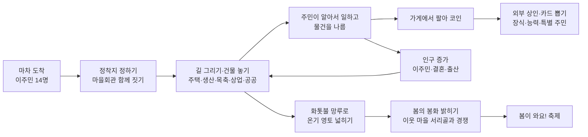
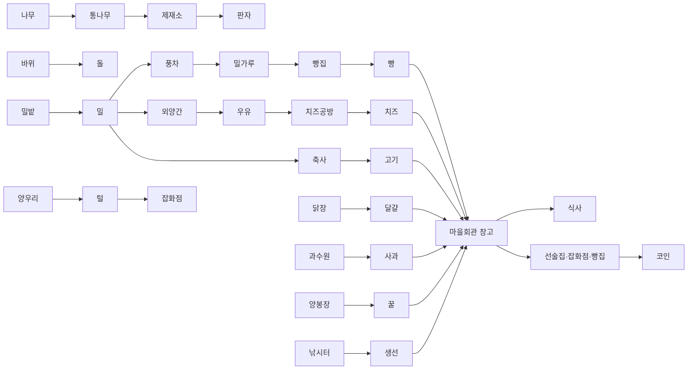

# 봄날의 행진 — 기획서 (v1, 2026-10-08)

> 끝나지 않는 겨울. 마차를 타고 온 이주민들이 마을을 세우고, 길을 내고, 물건을 이어 나르며 살아가요.
> 주민들은 일하고, 쉬고, 사귀고, 결혼하고, 아이를 낳고, 세상을 떠나요.
> 이웃 마을보다 먼저 **봄의 봉화**를 밝히면 겨울이 물러가요.

| 항목 | 내용 |
|---|---|
| 장르 | 마을 건설·물류 경영(세틀러식) + 주민 생활(심즈식) |
| 플랫폼 | PC(설치형) + 안드로이드 APK. 같은 웹 3D 코드(three.js)를 포장. 시험은 플레이 링크 |
| 화면 | 가로. 3D. 360° 회전·기울이기·확대(휠 가운데 끌기, 두 손가락 비틀기) |
| 그림체 | 서리마을 개척기의 장난감 같은 부드러운 3D 치비 (Blender 모델을 그대로 3D로) |
| 이름 | 봄날의 행진 |

## 1. 게임 흐름

## 2. 하루와 계절
| 때 | 주민이 하는 일 |
|---|---|
| 낮 (하루의 62%) | 일: 공사, 짐 나르기, 나무 베기, 채석, 농사, 목축, 낚시, 가공 |
| 저녁 (14%) | 쉬는 시간: 수다, 데이트, 선술집·가게, 집안 생활(요리·식사·독서·차) |
| 밤 (24%) | 집 침대에서 잠 (집 없으면 마을회관, 그것도 없으면 밖에서 떨며) |
- 하루 = 1배속 4분. 계절 하나 = 4일. 겨울 → 봄 → 여름 → 가을. 봉화를 밝히면 바로 봄.
- 아침마다 주민이 창고의 음식을 골고루 나눠 먹어요. 세 가지 이상 먹으면 기분 ↑.

## 3. 건물 (분류별)
| 분류 | 건물 | 하는 일 |
|---|---|---|
| 주택 | 오두막 → 큰 오두막 → 통나무집 | 2명 → 4명 → 6명. 업그레이드. 실내: 침대·부엌·난로·식탁(·거실·화장실). 옮기기 가능 |
| 생산 | 나무꾼 작업장 | 나무를 베어 통나무 (나무가 쓰러져요) |
| | 채석장 | 바위를 깨서 돌 |
| | 제재소 | 통나무 → 판자 |
| | 풍차 | 밀 → 밀가루 (날개가 돌아요) |
| | 빵집 | 밀가루 → 빵 2개. 손님에게도 팔아요 |
| | 치즈 공방 | 우유 → 치즈 |
| | 낚시터 | 호숫가에서 생선 낚기 |
| 목축·농사 | 밀 농장 | 밭에 심고 자라면 거두기 |
| | 닭장 | 닭 → 달걀 |
| | 외양간 | 젖소·염소 → 우유 (밀을 먹여요) |
| | 양 우리 | 양 → 털 |
| | 축사 | 돼지·소 → 고기 (밀을 먹여요) |
| | 과수원 | 사과나무 → 사과 |
| | 양봉장 | 벌통 → 꿀 |
| 상업 | 선술집 | 저녁 모임. 음식을 팔아 코인 |
| | 잡화점 | 털(옷)·꿀·사과 등을 팔아 코인 |
| | 시장 가판대 | 외부 상인이 머무는 곳 |
| 공공 | 마을회관 | 마을의 중심·창고. 사무실·회의실·식당·화장실 |
| | 우물·벤치·가로등 | 모여 쉬는 곳 |
| | 화톳불 망루 | 온기 영토 넓히기 |
| | 봄의 봉화대 | 최종 목표. 하나만 |
| 장식 | 분수·정자·동상·꽃밭·그네 등 | 둘레 주민 기분 ↑ (상인·카드로 얻어요) |

## 4. 생산 줄

## 5. 길과 나르기
- 길은 손가락·마우스로 **끌어서 그린 대로** 구불구불하게. 다른 길과 만나면 저절로 이어져요.
- **흙길 → 자갈길 → 돌길**: 길을 누르고 업그레이드. 주민 한 명이 돌을 깔며 지나가요. 걷는 속도 ×1.0 / ×1.15 / ×1.3 (눈밭은 ×0.7).
- 깃발은 없어요. 쉬는 주민이 짐을 **한 번에 3개까지** 들고 목적지까지 바로 가요.

## 6. 주민
| 항목 | 내용 |
|---|---|
| 모습 | 서리마을 주민 17종 + 일할 때 작업복(나무꾼·광부·농부·낚시꾼) |
| 성격 | 성실·느긋·명랑·씩씩·수줍·투덜 → 감정 표현이 달라져요 |
| 감정 표현 | 힘든 척(땀·느린 걸음), 하기 싫은 척(투덜), 좋은 척(하트), 씩씩한 척(손 흔들기) — 말풍선과 표정 |
| 필요 | 기운(일하면 줄고 자면 참), 기분(음식·집·친구·연인·장식·행사), 배고픔 |
| 관계 | 수다 → 친구 → 연인 → 결혼(마을 잔치) → 아기(축하) |
| 일생 | 아이는 2년이면 어른(시제품 압축). 어르신은 세상을 떠나고 장례식 |
| 실내 생활 | 의자에 앉기, 식사, 차, 독서, 요리, 세수, 화장실, 침대에서 잠 |
| 이주민 | 며칠마다 찾아옴 → 받기/돌려보내기 → 받으면 스스로 오두막을 지어 살아요 |

## 7. 경제
- **코인**: 저녁에 주민이 가게를 이용하면 창고 물건이 팔리고 코인이 들어와요.
- **외부 상인**: 이틀마다 와서 하루 머물러요. 특별한 물건·생활용품·미술품(장식), 능력(연장 세트·장화·담요), 물건 꾸러미.
- **카드 뽑기**: 한 번에 30코인. 확률 공개 — 특별 주민 5%, 장식 20%, 능력 카드 25%, 물건 꾸러미 50%.
- 진짜 돈 결제(무료 + 유료 구매)는 출시 직전에. 뽑기 확률 공개 의무를 지켜요.

## 8. 영토와 이웃 마을 (평화 경쟁)
- 마을회관(30m)·집(11m)·선술집(12m)·화톳불 망루(22m)·봉화대(34m)가 **온기**를 퍼뜨려요. 온기 안(주황 선)에만 지을 수 있어요.
- 지도 반대편의 이웃 마을 **서리골**도 스스로 자라고(반나절마다 건물 하나), 사흘째부터 봉화를 준비해요(약 18일).
- 두 마을의 온기가 겹치면 더 센 쪽 땅. 싸움은 없어요.
- **봄의 봉화대**(판자 20·돌 30·빵 10·꿀 3)를 먼저 밝히면 🏆. 봄이 오고 마을 축제가 열려요.

## 9. 다음 단계 (제안)
1. 휴대폰 실기기 시험과 APK 포장(Capacitor), PC 설치판(Electron 또는 Tauri)
2. 저장하기/불러오기
3. 계절마다 땅·나무 모습 바꾸기(봄 풀밭, 가을 단풍)
4. 관광객(3차 산업), 건물 레벨 4~5단계, 집 꾸미기(가구 배치)
5. 이웃 마을과 교역·방문 이벤트
